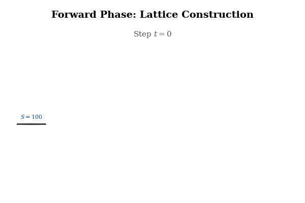

# Parallel Binomial Option Pricing

Accelerating American option pricing using binomial trees with parallel algorithms on CPU and GPU architectures.

### Binomial Option Pricing Visualization
The Binomial Options Pricing Model (BOPM) operates in two phases:
1.  Forward Phase (Lattice Construction): Builds a tree of possible future prices (S) from today (t=0) up to expiration (t=N).
2.  Backward Phase (Valuation): Calculates option values (V) starting from expiration and moving backwards. For American options, the value at each node is determined by checking for early exercise:
    `V = max(Exercise Value, Hold Value)`
    where Exercise Value is the immediate payoff and Hold Value is the discounted expected value of holding the option.

The animation below demonstrates the pricing of an American Call Option with parameters: **S0 = $100, K = $100, r = 5%, sigma = 20%, T = 3 steps**.




## Build Instructions
```bash
mkdir build && cd build
cmake ..
make
```


## References
See [docs/proposal.pdf](docs/proposal.pdf)